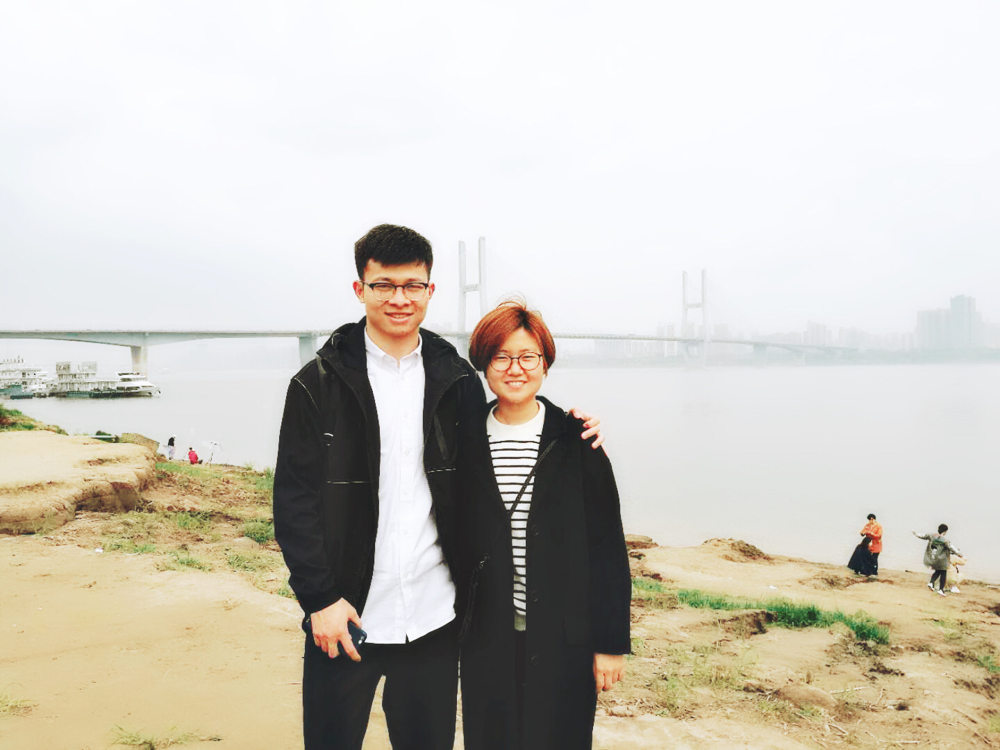

 <i>with my wife Ziqian Liu</i> 

# Basic information

Yang Kuang is a Research Fellow working with [Prof. Zhenning Cai](https://blog.nus.edu.sg/matcz/) in the [Departmen](https://www.math.nus.edu.sg/)[t of Mathematics](https://www.math.nus.edu.sg/) at the National University of Singapore.  He got his Ph.D. degree in Mathematics at theUniversity of Macau in 2019, under the supervision of [Prof. Guanghui Hu](https://www.fst.um.edu.mo/people/garyhu/). His research interests include adaptive finite element methods and efficient numerical algorithms for density functional theory. He is also interested in the complex Langevin methods in path integral computations.

# Education

- Ph.D. in Computational Mathematics, 2019, University of Macau. Supervisor: [Prof. Guanghui Hu](https://www.fst.um.edu.mo/people/garyhu/)
- M.sc. in Computational Mathematics, 2016, University of Macau. Supervisor: [Prof. Guanghui Hu](https://www.fst.um.edu.mo/people/garyhu/)
- B.sc. in Information and Computational Science, 2013, Wuhan University.

# Contact

\#07-15, Block S17

Department of Mathematics
National University of Singapore
10 Lower Kent Ridge Road
Singapore 119076

Email: matkuan@nus.edu.sg

